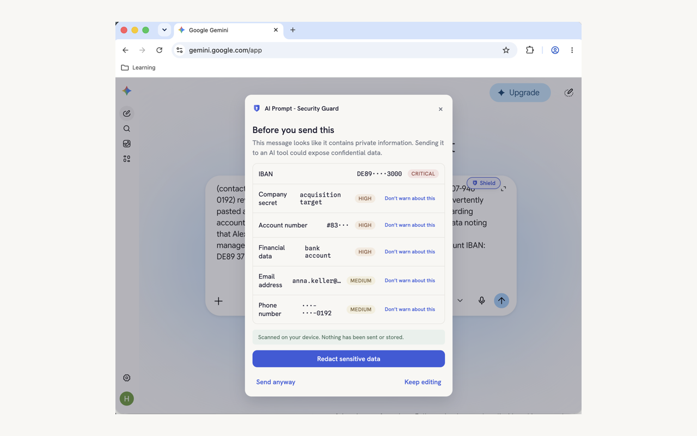
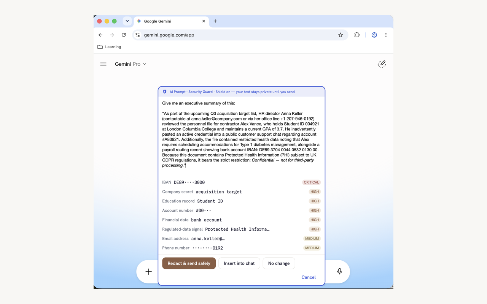
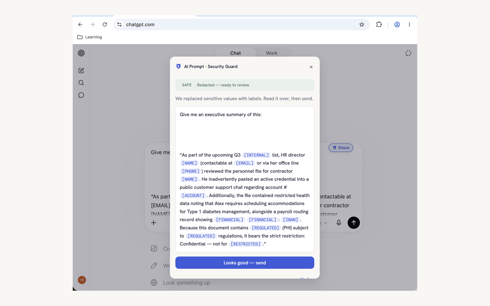
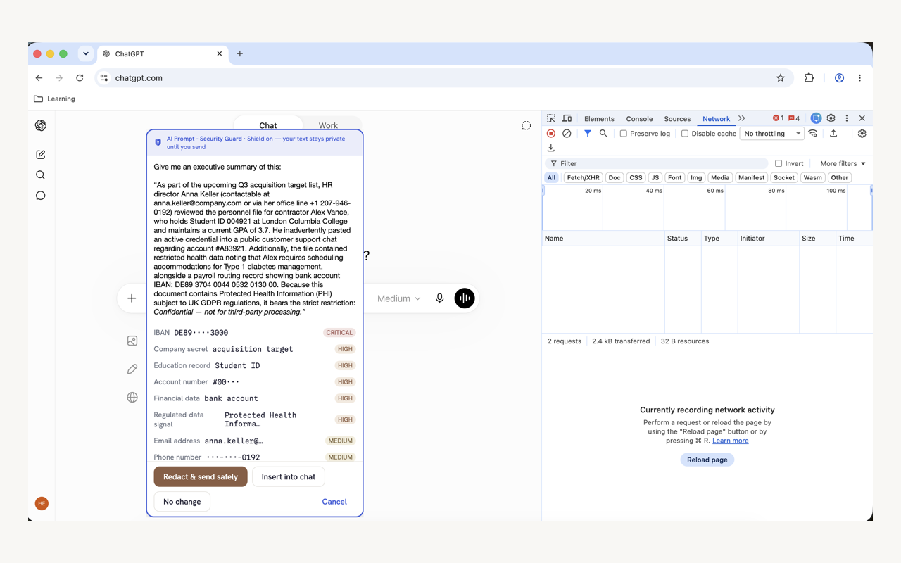
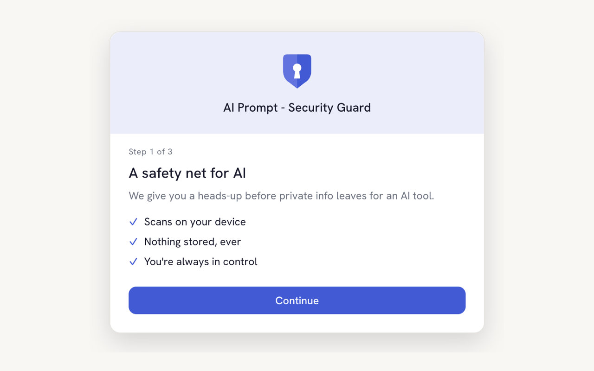
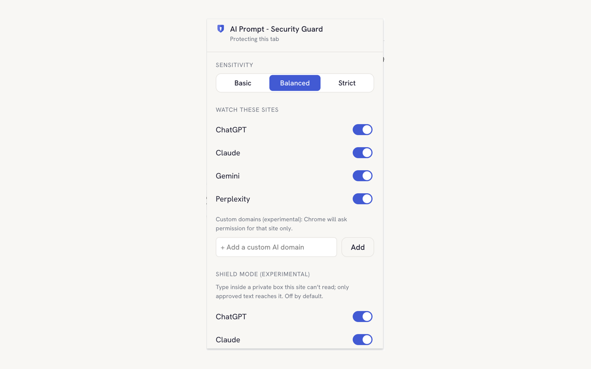

  

<h1 align="center">AI Prompt - Security Guard</h1>

<b>Think before you send.</b> A free Chrome extension that warns you before private information reaches an AI tool. All scanning happens on your device — no accounts, no logging, no network calls.

  
  
  
  

## Install

🛡️ **[Get AI Prompt - Security Guard on the Chrome Web Store](https://chromewebstore.google.com/detail/ai-prompt-security-guard/ipoadoogocaeeijapcohiehibkoihcdn)** — free, no account needed.

## See it in action

▶️ **[Watch the 1-minute demo](https://www.youtube.com/watch?v=Qj2S3MiqH-w)** — type a secret, the badge turns red, the warning opens, one click redacts.

  

| The pre-send warning — findings listed, values masked | Shield Mode — type privately, the site can't read it |
|---|---|
|  |  |
| **One-click redaction — secrets become safe labels** | **Verify it yourself — zero network activity while you type** |
|  |  |
| **Three-step setup** | **Sensitivity, sites & Shield Mode in one small popup** |
|  |  |

*The same screenshots ship on the [Chrome Web Store listing](https://chromewebstore.google.com/detail/ai-prompt-security-guard/ipoadoogocaeeijapcohiehibkoihcdn).*

## What this does

AI Prompt - Security Guard watches the message box on ChatGPT, Claude, Gemini, Perplexity, and Microsoft Copilot. As you type, it scans your text locally for sensitive information: emails, phone numbers, credit cards, SSNs, API keys, passwords, and confidential business, legal, financial, or health language.

If you try to send something risky, it pauses and shows a clear warning listing what it found, always masked, never the raw secret. You can redact the values, send anyway, or keep editing. Your text never leaves your device.

## Features

- Local scanning. Prompts are analyzed on your device, never stored or uploaded.
- Pre-send warning that lists what was found, with masked values only.
- Live risk badge near the input box that updates as you type.
- One-click redaction that swaps sensitive values for labels like [EMAIL] and [API_KEY].
- Attachment scanning. Attach a PDF or Word file and it scans the file's text on your device, including hidden comments and metadata. Pasted or attached images get a gentle reminder — screenshots often carry secrets no text scanner can read.
- US and EU coverage: detection keywords in English, French, German, and Spanish, plus checksum-validated European identifiers (IBAN, French NIR, German Steuer-ID, Spanish DNI) alongside SSNs and cards.
- Nothing derived from your text is ever stored — not even masked values. The only stored numbers are your settings and a local "risky sends caught" counter.
- **Shield Mode (experimental, opt-in per site):** click the Shield chip on the chat box to type inside an extension-owned composer the website's scripts cannot read; only approved (optionally redacted) text is placed into the real message box. The strongest answer to "sites that read drafts as you type."
- Three sensitivity modes: Basic, Balanced, and Strict.
- Per-site control from a small popup, plus experimental custom domains: add any https AI site and Chrome asks you to grant access for that one site only.
- Accessible. Fully keyboard operable with visible focus and screen-reader support, meeting WCAG 2.1 AA and Section 508.
- Least privilege. Runs only on the supported AI sites by default; custom domains are granted per-site at the moment you add them, never as blanket access.
- No accounts, no ads, no prompt logging, and no network calls at all.

## Who is this for

Everyday AI users, employees using AI at work, students and researchers, freelancers, developers who do not want to paste keys or source into a chat box, and security-conscious teams.

## Getting started

**Regular install:** add it from the [Chrome Web Store](https://chromewebstore.google.com/detail/ai-prompt-security-guard/ipoadoogocaeeijapcohiehibkoihcdn). The setup screen opens on first install — choose your sensitivity and the sites to watch.

**From source (development):**

1. Run `npm install` then `npm run build`.
2. Open `chrome://extensions` and turn on Developer mode.
3. Click "Load unpacked" and select the `dist` folder.

### Adding a custom domain (experimental)

1. Open the popup and type the domain (e.g. `chat.example.com`) under "Watch these sites".
2. Chrome shows a permission prompt for that site only — approve it.
3. Reload any open tabs of that site once. A generic adapter finds the prompt box on a best-effort basis; sites with unusual composers may not be fully supported.

Removing the domain from the popup unregisters the scanner and withdraws the site permission.

## Common issues

**Fonts look wrong on a site.** Some sites have a strict Content Security Policy. The extension loads its own fonts to work around this; if you see a system font, reload the tab once.

**Badge or warning does not appear.** AI sites change their layout often. Reopen the popup and confirm the site toggle is on. If it still does not appear, check the console for a message starting with `[AI Prompt - Security Guard]`.

**Nothing is saved.** Settings live in browser local storage. Locked-down or guest profiles that block extension storage will not persist preferences.

**A custom domain stopped working.** If you revoked the site's permission from `chrome://extensions` → Details → Site access, the scanner was automatically unregistered. Remove the domain in the popup and add it again to re-grant access.

## Privacy

Scanning is local and there are no network calls. The extension stores only your settings and a single "risky sends caught" counter, never your text or files. Full policy: [PRIVACY.md](PRIVACY.md).

## Accessibility and compliance

The interface is built to WCAG 2.1 AA and Section 508: keyboard operable, with visible focus, programmatic labels, and a screen-reader friendly warning dialog. Conformance is covered by automated tests. A self-assessed Accessibility Conformance Report (VPAT), a Software Bill of Materials, and a security overview for organizations and government agencies are in the [Documentation](#documentation) section below.

## Documentation

Practical guidance on using AI tools without leaking sensitive data: [AI Safety - Best Practices](docs/AI%20Safety%20-%20Best%20Practices.pdf).

For organizations evaluating the extension, including government agencies:

- [Federal security overview](docs/FEDERAL-SECURITY-OVERVIEW.md) - data flow, permissions, and secure-development summary.
- [Accessibility Conformance Report (VPAT)](docs/VPAT.md) and the [accessibility audit](docs/ACCESSIBILITY-AUDIT.md) - WCAG 2.1 AA / Section 508.
- [Software Bill of Materials](docs/sbom.cyclonedx.json) - CycloneDX, regenerate with `npm run gen:sbom`.

## Author

Hemant Naik [LinkedIn](https://www.linkedin.com/in/tanaji-naik/) · [hemant.naik@gmail.com](mailto:hemant.naik@gmail.com)

Built March 2026
